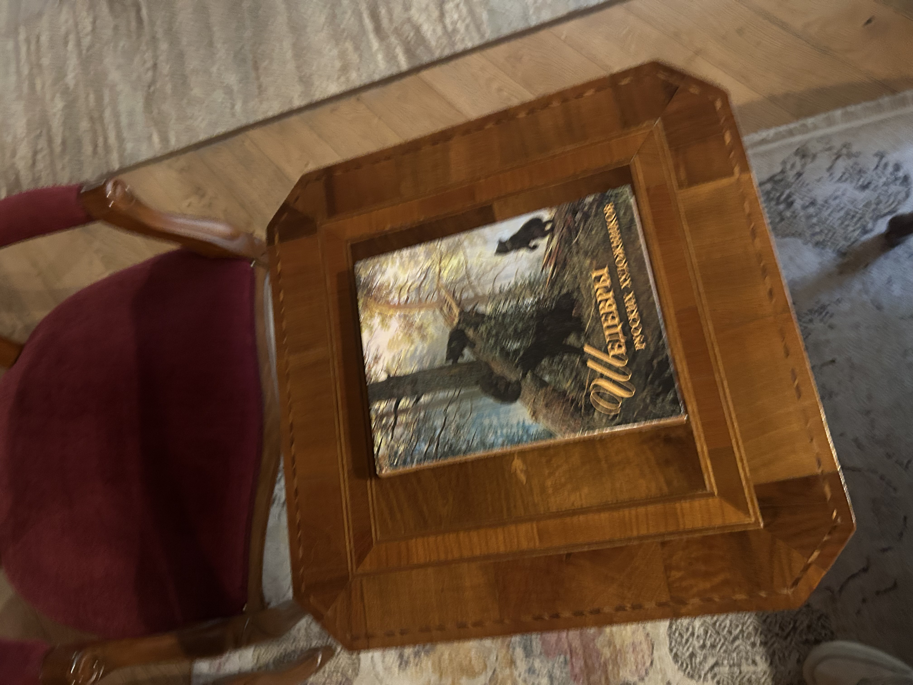
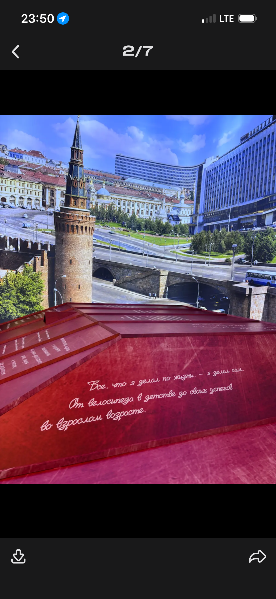
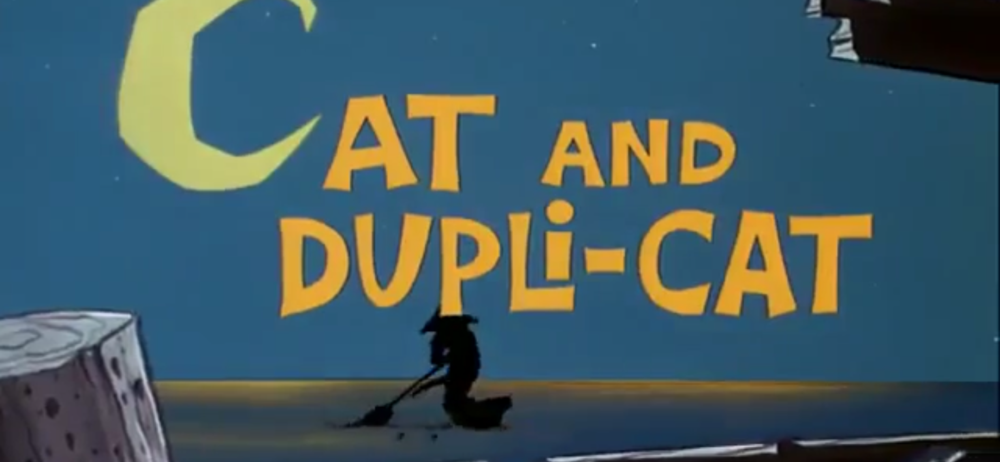
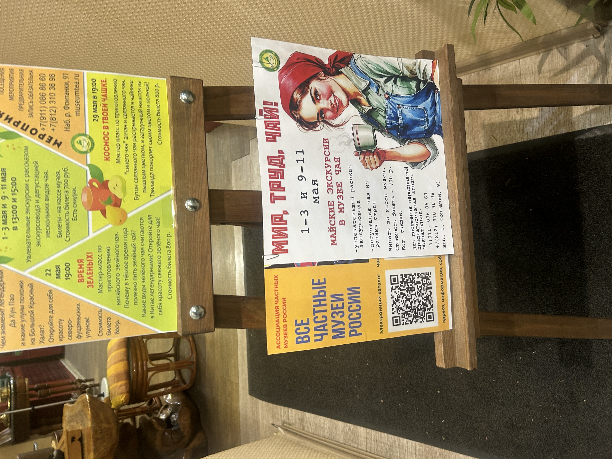
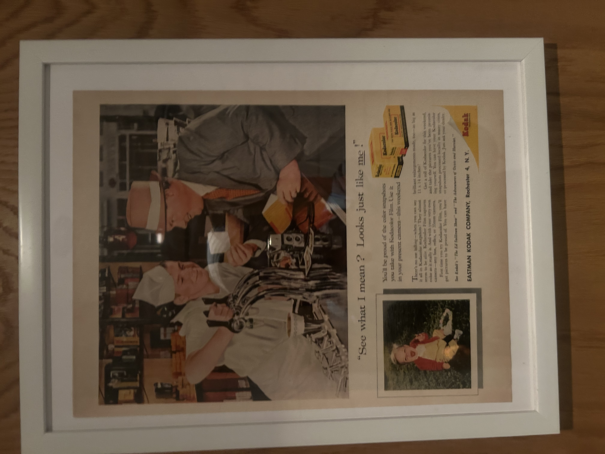

Представь, что сейчас не 2026, а какие-нибудь цифровые 60-е — эпоха новых хиппи, только вместо автостопа по трассам у нас автостоп по платформам.

Свобода, но не та, что раньше.

Теперь она измеряется количеством мессенджеров.

Каждый день появляется новый. Один — «более приватный», второй — «без алгоритмов», третий — «вообще без всего, кроме смысла». Даже YouTube, как старый рок-клуб, внезапно снова открывает личные сообщения — мол, заходите, поговорим.

И ты сидишь среди всего этого, как будто на вечеринке, где все говорят одновременно, но никто не уверен, где настоящая тусовка.

Подписчики больше не просто подписчики. Это почти как свадьба.

Ты не можешь «запостить ссылку». Нужно разослать приглашения:  
— сюда подпишись  
— тут основной канал  
— здесь «более личное»  
— а вот это вообще для своих  

Каждому — открытку. Почти вручную. Почти с душой.

И ты ловишь себя на мысли, что собираешь не аудиторию, а гостей.

Параллельно с этим каналы плодятся как временные коммуны. Сегодня создал — завтра забросил. Или переименовал. Или сделал новый, чтобы «начать с чистого листа».

Цифровой след больше не прячут — его размывают.

Не один аккаунт, а десять. Не одна платформа, а пять. Не единая история, а набор фрагментов, которые сложно собрать в одно целое.

Это уже не про приватность. Это про рассеивание.

И, может быть, самое точное отражение этого времени — это не каналы и даже не приложения.

А сцены.

Короткие, самодостаточные эпизоды, как Том и Джерри — только в реальной жизни.

Не нужно больше придумывать «фильм».  
Не нужно держать цельный нарратив.  

Достаточно одной ситуации:  
— странный диалог в кофейне  
— абсурдный баг в интерфейсе  
— микро-драма в чате  
— кто-то зашёл не туда и всё пошло не по плану  

И это уже контент.

Такие сцены проще снимать, проще публиковать, проще потреблять. Они не требуют объяснений. У них нет обязательного «начала и конца» — только момент, который сам себя оправдывает.

Как будто вся культура сместилась от историй к фрагментам.

И в этом есть что-то очень хипповское.

Жить не «проектом», а моментами.

И самое забавное — инструменты стали настолько лёгкими, что идеи почти не успевают оформляться.

Любой блокнот — это уже потенциальный продукт.

Хочешь новое приложение?  
Открыл редактор, подключил AI, накинул интерфейс — через пару минут у тебя MVP «для заметок, но с вайбом».  

Не успел подумать — уже сделал.

Мы живём в мире, где создание стало быстрее осознания.

И, может быть, именно поэтому всё так похоже на 60-е.

Много свободы.  
Много шума.  
Много попыток найти «своё место» — только теперь не в городе или стране, а в потоке платформ.

Цифровые хиппи не ищут, где жить.

Они ищут, где остаться.

    
