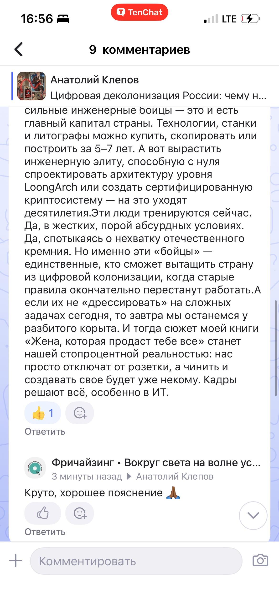
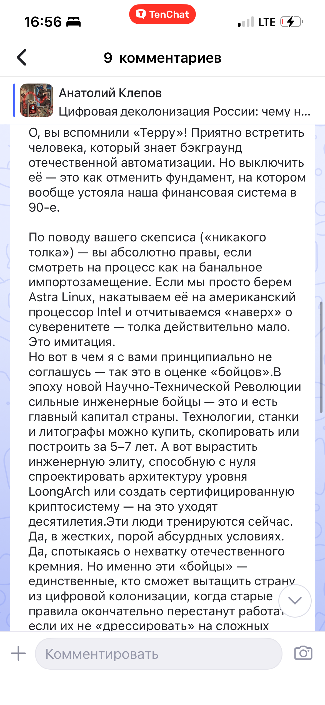

## Кто говорит

**Анатолий Клепов:**

> Заменить Windows отечественной операционной системой — ещё не значит обрести технологический суверенитет. Пока российское программное обеспечение работает на иностранном процессоре, цепочка зависимости не разорвана.  
> Китай это понял и начал перестраивать весь технологический стек — от чипа до кода.
>
> Пекин ускоряет замену Windows и другого зарубежного программного обеспечения в государственных учреждениях и критической инфраструктуре. Но речь идёт не о новых иконках на мониторах чиновников. Китай демонтирует систему, в которой ключевые цифровые процессы зависят от решений, лицензий и технологий иностранных корпораций.
>
> Цифровая зависимость — это оружие.
>
> Мир безусловного доверия к транснациональным ИТ-гигантам закончился.
>
> Санкции, торговые войны и технологические ограничения показали: иностранная цифровая платформа может в любой момент превратиться из удобного инструмента в средство политического давления.
>
> Поставщик способен прекратить обновления, отозвать лицензии, ограничить доступ к облачным сервисам или закрыть техническую поддержку.
>
> А государство, построившее на чужих технологиях банки, связь, энергетику и систему управления, внезапно обнаружит, что оно не контролирует собственную инфраструктуру.
>
> Пекин усвоил простую истину:
>
> Кто контролирует операционную систему, процессор и инфраструктуру обновлений, тот контролирует цифровой контур государства.
>
> Именно поэтому Китай не ограничивается заменой Windows.
>
> Китай меняет весь технологический стек.
>
> На место зарубежных операционных систем приходят китайские платформы, преимущественно созданные на базе Linux:
>
> - Kylin OS — система, которая первоначально развивалась для государственных и оборонных задач, а сегодня используется значительно шире;
> - UOS — платформа компании UnionTech, ориентированная на государственный сектор, бизнес и массового пользователя.
>
> Однако собственная операционная система — только один этаж цифрового здания.
>
> Невозможно говорить о полном технологическом суверенитете, если программное обеспечение работает на аппаратной архитектуре, которую государство не контролирует. Поэтому развитие Kylin OS и UOS идёт вместе с продвижением китайских процессорных платформ Loongson, Phytium и Kunpeng.
>
> Китай выстраивает единую цепочку доверия:
>
> собственная процессорная архитектура → собственная аппаратная платформа → собственная операционная система → собственное прикладное ПО → собственная инфраструктура обновлений.
>
> Вот что такое реальная цифровая деколонизация.
>
> Не переклейка этикеток. Не переименование зарубежного продукта. Не российский интерфейс поверх иностранного процессора.
>
> Это контроль над всей системой — от команды процессора до последней строки кода.
>
> Главный урок для России
>
> Мы слишком часто называем импортозамещением замену одной программы другой.
>
> Зарубежную операционную систему меняют на российскую, добавляют продукт в реестр и объявляют задачу выполненной.
>
> Но если под отечественным программным обеспечением остаётся полностью зависимая аппаратная основа, это не суверенитет. Это полуимпортозамещение.
>
> Мы меняем приборную панель, но двигатель, электроника и ключи от машины по-прежнему принадлежат другому производителю.
>
> Проблема не в том, что весь иностранный процессор обязательно содержит аппаратную закладку. Проблема в другом: государство не всегда может независимо проверить архитектуру, микрокод, механизмы удалённого управления и всю цепочку поставок.
>
> В бытовом компьютере подобный риск ещё можно принять. В системе управления электростанцией, банковской инфраструктурой, государственной связи или оборонном комплексе — нельзя.
>
> Если критическая система зависит от внешних технологий, она работает не только на электричестве. Она работает ещё и на чужом разрешении.
>
> Суверенитет нельзя купить по частям.
>
> Нельзя построить защищённое государство, закупив несколько отечественных программ и продолжая зависеть от зарубежных компонентов на всех остальных уровнях.
>
> Цифровой суверенитет начинается там, где страна способна:
>
> - самостоятельно развивать критические технологии;
> - проверять аппаратную и программную архитектуру;
> - выпускать обновления без разрешения внешнего поставщика;
> - устранять уязвимости собственными силами;
> - поддерживать работу инфраструктуры при любых санкциях;
> - контролировать хранение, обработку и передачу государственных данных.
>
> Это не означает, что Россия должна немедленно закрыться от всего мира и самостоятельно производить каждый винтик.
>
> Суверенитет — не изоляция.
>
> Но у страны не должно быть критических узлов, отключение которых способно остановить государство.
>
> Россия обязана сама держать рубильник от собственной цифровой инфраструктуры.
>
> От импортозамещения — к новой НТР
>
> Китайский опыт показывает: выигрывает не тот, кто лучше копирует чужие продукты, а тот, кто создаёт собственную инженерную школу и собственные технологические правила.
>
> Бесконечно догонять Windows, Android, Intel или AMD — значит добровольно соглашаться на роль вечного преследователя. Пока мы повторяем вчерашнее решение конкурента, он уже создаёт завтрашнее.
>
> России нужна не очередная кампания по замене логотипов. Нужна полноценная научно-техническая революция: развитие микроэлектроники, процессорных архитектур, системного программного обеспечения, средств разработки, телекоммуникационного оборудования и инженерного образования.
>
> Государственный заказ должен поддерживать не отдельных победителей тендеров, а целые технологические экосистемы.
>
> При этом нельзя менять иностранную зависимость на монополию одного отечественного поставщика. Если российская компания получает гарантированный рынок, она должна отвечать за безопасность, совместимость, качество и развитие продукта — а не только за его присутствие в реестре.
>
> Россия уже доказывала, что способна создавать новое.
>
> Мне эта тема близка не только как автору статьи.
>
> Моя компания разработала собственную защищённую операционную систему для криптосмартфона. Проект прошёл государственные проверки и показал: российские инженеры способны не только адаптировать готовые иностранные решения, но и создавать оригинальные архитектуры информационной безопасности.
>
> Концепция устройства вызвала интерес и удивление даже у Билла Гейтса. Для нас это было важно не как комплимент от основателя Microsoft, а как подтверждение: российская инженерная команда может предложить решение, которого не ожидают от страны, привыкшей жить в роли технологического покупателя.
>
> Но этот опыт продемонстрировал и другую истину.
>
> Даже самая защищённая операционная система не создаёт полного суверенитета, если аппаратная основа остаётся за пределами вашего контроля. Защищённый софт на непрозрачном железе — это только половина крепости. Стены построены, охрана расставлена, но ключ от подвала может находиться неизвестно у кого.
>
> Именно поэтому России нужен собственный доверенный стек — не в отчётах, а в реальной критической инфраструктуре.
>
> «Жена, которая продаст тебе всё»
>
> О том, что может произойти со страной, если она ограничится цифровыми полумерами, я написал в книге «Жена, которая продаст тебе всё».
>
> В ней я обращаюсь к традиции бытовой сатиры Михаила Зощенко. Потому что иногда глобальную технологическую угрозу легче увидеть не с высокой государственной трибуны, а из квартиры обыкновенного человека.
>
> Представьте: гражданин спокойно сидит в своём умном доме и включает «импортозамещённый» утюг. Утюг внезапно заговаривает на китайском языке, отключает отопление и блокирует двери. Где-то далеко сервер передал команду, а встроенный в зарубежный компонент протокол послушно её выполнил.
>
> Гражданин в одних подштанниках выпрыгивает в окно и проклинает цифровую эпоху.
>
> В книге это сатира.
>
> В энергетике, связи, банковской системе и государственном управлении подобный сюжет уже не будет смешным.
>
> Чужая технология в критической инфраструктуре похожа на ту самую «жену», которая улыбается, обещает комфорт и хранит все ваши тайны, но в решающий момент может продать вас вместе с паролями, документами и государственными данными.
>
> Время переклеивания этикеток закончилось.
>
> Перед Россией стоит выбор.
>
> Можно продолжать выпускать «отечественные» решения, критические компоненты которых создаются и контролируются за пределами страны. Можно менять названия программ, отчитываться о процентах импортозамещения и успокаивать себя красивыми презентациями.
>
> А можно признать: цифровой суверенитет нельзя построить наполовину.
>
> Он начинается не с российского логотипа на экране. Он начинается с собственной научной школы, собственной архитектуры и способности государства сохранить управление критической инфраструктурой при любом внешнем давлении.
>
> Китай уже сделал свой выбор.
>
> Теперь его должна сделать Россия.
>
> Либо мы создаём собственную цепочку доверия — от чипа до кода, либо однажды обнаружим, что наше “импортозамещение” можно отключить чужой командой.
>
> И тогда шутить будем уже не мы.

---

**Мой комментарий:**

> Может лучше Терру выключить для начала? А процессоры мы давно делаем, также как Astra Linux, только никакого толка от этого, кроме дрессировки сильных бойцов в непонятно для кого и непонятно в каких целях.

**Ответ:**

> О, вы вспомнили «Терру»! Приятно встретить человека, который знает бэкграунд отечественной автоматизации. Но выключить её — это как отменить фундамент, на котором вообще устояла наша финансовая система в 90-е.
>
> По поводу вашего скепсиса («никакого толка») — вы абсолютно правы, если смотреть на процесс как на банальное импортозамещение. Если мы просто берем Astra Linux, накатываем её на американский процессор Intel и отчитываемся «наверх» о суверенитете — толка действительно мало. Это имитация.
>
> Но вот в чем я с вами принципиально не соглашусь — так это в оценке «бойцов». В эпоху новой научно-технической революции сильные инженерные бойцы — это и есть главный капитал страны. Технологии, станки и литографы можно купить, скопировать или построить за 5–7 лет. А вот вырастить инженерную элиту, способную с нуля спроектировать архитектуру уровня LoongArch или создать сертифицированную криптосистему — на это уходят десятилетия.
>
> Эти люди тренируются сейчас. Да, в жестких, порой абсурдных условиях. Да, спотыкаясь о нехватку отечественного кремния. Но именно эти «бойцы» — единственные, кто сможет вытащить страну из цифровой колонизации, когда старые правила окончательно перестанут работать.
>
> А если их не «дрессировать» на сложных задачах сегодня, то завтра мы останемся у разбитого корыта. И тогда сюжет моей книги «Жена, которая продаст тебе всё» станет нашей стопроцентной реальностью: нас просто отключат от розетки, а чинить и создавать своё будет уже некому. Кадры решают всё, особенно в ИТ.

**Круто, хорошее пояснение 🙏🏾**

 
