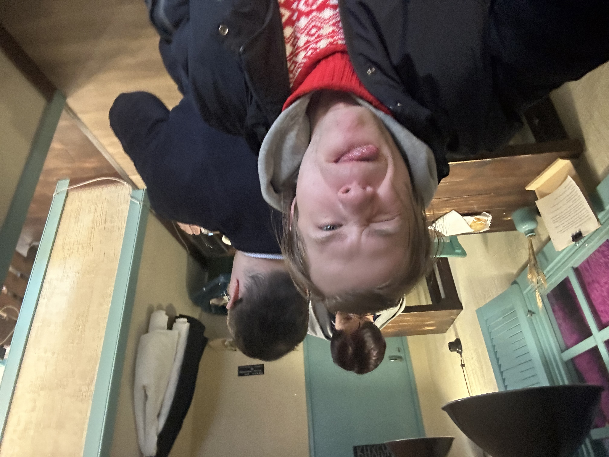
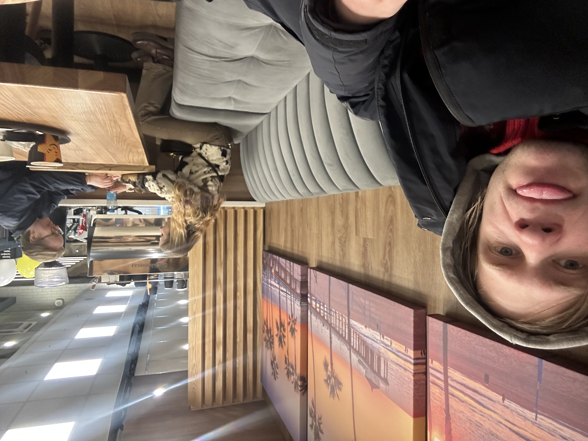
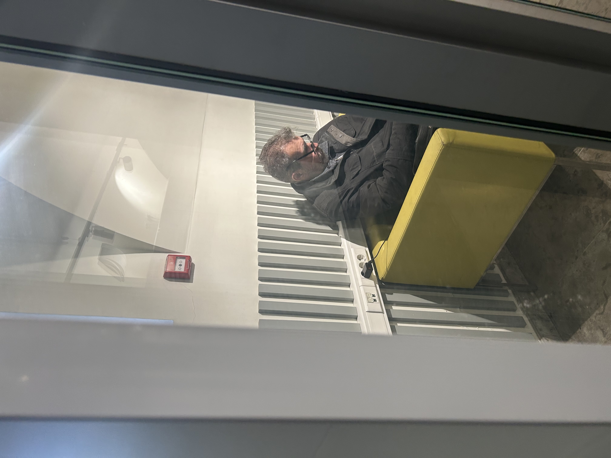

Привет, друзья! 

В мире полно вдохновляющих личностей, но сегодня я решил поговорить о тех, кто меня бесит. "Галерея тиранов" — это мой личный пантеон раздражителей. Не политики, не звёзды — просто люди (или типы людей), чьи привычки, фразы или действия заставляют меня скрипеть зубами. Почему? Каждый с причиной. 

## Топ тиранов

- **"Мастер парковки на два места"**  
  Этот тип заезжает своей "Ладой" так, что места для соседей не остаётся. Раздражает эгоизм: мир не крутится вокруг твоего бампера!

- **"Громкий звонилка в транспорте"**  
  Стоит в метро и орёт в трубку: "Алё, слышь, я в шоке!". У меня в наушниках подкаст, а уши закладывает от чужой драмы.

- **"Спамер в чатах 'родных'"**  
  "Дорогие, скидки на носки! ❤️" — и 50 сообщений в день. Блок не спасает, потому что "семья".

- **"Морализатор в комментах"**  
  Пишешь пост про кофе — он: "Это вредно, брось!". Эксперт по всему, но сам в жизни ноль.

- **"Вечный опоздыватель на встречи"**  
  "Извини, пробки/погода/кот заболел". Час ожидания — и ты уже тиранишь свой кофе.

Это не ненависть, а терапия: выплеснул — полегчало. А у вас есть свои тираны? 